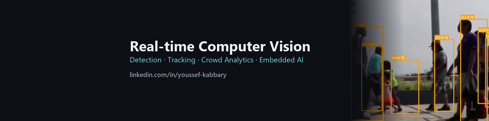
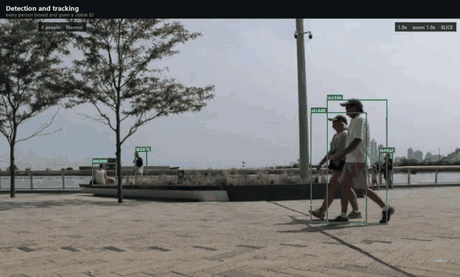
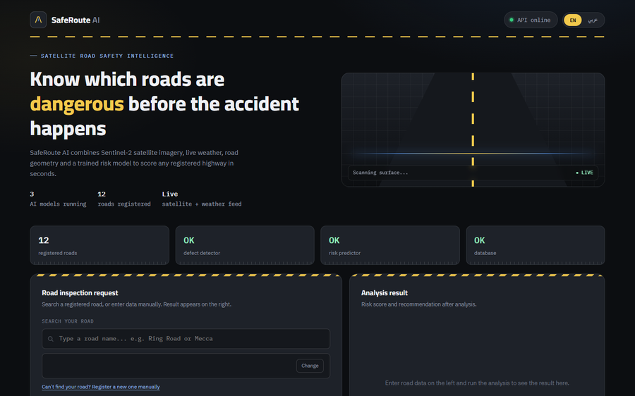
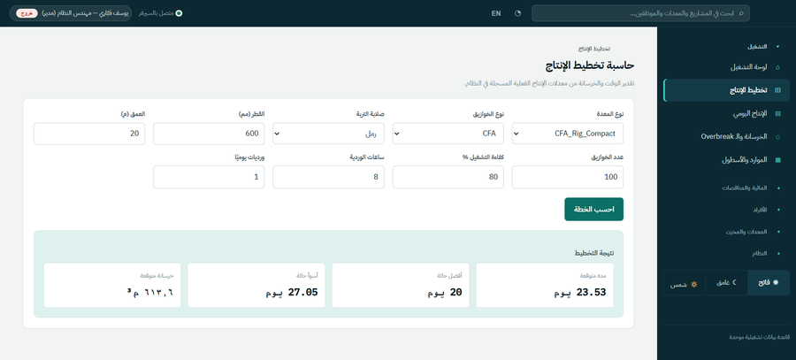

## Hi, I'm Youssef Kabbary

**AI & Computer Vision Engineer** · R&D Engineer at Smart Technology, Alexandria
B.Sc. Artificial Intelligence, Pharos University in Alexandria (2025)

I build computer vision systems that run in real time, and I measure them before I make claims about them.
When a number can't be backed by a test yet, the README says so.

  
  
  

---

### 👥 [Crowd Master v2](https://github.com/YoussefKabbary/Crowd-Intelligence-System) — real-time crowd analytics

<table>
<tr>
<td width="46%"></td>
<td>

People counting, doorway entry/exit counting, zone occupancy and anomaly clips for CCTV, webcams, IP/RTSP cameras and phones.

- An audited rebuild of my own v1: **28 documented defects** found and fixed
- **43–72 ms per frame** (v1: 95–232 ms) and **0.6 s** to the first useful frame (v1: 10.4 s), on a laptop RTX 3050
- YOLOv8 bodies fused with YOLOv8-pose head points, ByteTrack IDs, multi-threaded pipeline, REST API
- v1 and v2 recorded running side by side on the same video
- Detection accuracy on real footage is not benchmarked yet, and the repo says so

</td>
</tr>
</table>

### 🛣️ [SafeRoute AI](https://github.com/YoussefKabbary/SafeRoute-AI) — road risk scoring API

<table>
<tr>
<td width="46%"></td>
<td>

Scores how dangerous a road is, 0 to 1, in English and Arabic, from four independent signals:

- **Geometry** measured from OpenStreetMap + SRTM and scored with AASHTO formulas (reproduces AASHTO's own tables)
- **Transformer accident predictor** trained on 191,454 real FARS fatal crashes: **AUC 0.628** on 47 locations it never saw, beating logistic regression (0.606) and gradient boosting (0.624)
- **Sentinel-2 hazards**: flooding, sand and roadside canals, compared against the same road a year earlier
- **YOLOv8 pavement defects** from street-level photos

A model that cannot run contributes nothing instead of a fake 0.5, and every response names the models that actually ran.

</td>
</tr>
</table>

### 🏗️ Operations platform for a piling contractor — *confidential, no public code*

<table>
<tr>
<td width="46%"></td>
<td>

An internal system I built end to end: **141 API routes** over **43 PostgreSQL tables**, **28 schema migrations** and **254 automated tests**.

Piling and concrete-pour records, a pile quantity and cost estimator, HR and attendance, global search and a full audit trail, behind an Arabic right-to-left interface built for use on site.

The tests are written around the risks: one account can never read another's rows, login hardening, request limits, a cold start on an empty database, and pinned estimator arithmetic.

</td>
</tr>
</table>

---

### 🧩 Earlier work

| Project | What it is | Tech |
|---|---|---|
| **AgliFly** | Graduation project, graded Excellent: autonomous surveillance drone with CNN object detection running on board a Raspberry Pi | Python · CNN · OpenCV · Raspberry Pi |
| **Smart Aquarium IoT** | Arduino Nano controller with temperature control, ammonia sensing, automated feeding and Bluetooth monitoring, with a Windows desktop app | Arduino · Bluetooth · Python |

### 🧠 Stack

**Computer vision & deep learning**  

**Backend & deployment**  

**Embedded**  

**Languages**  

